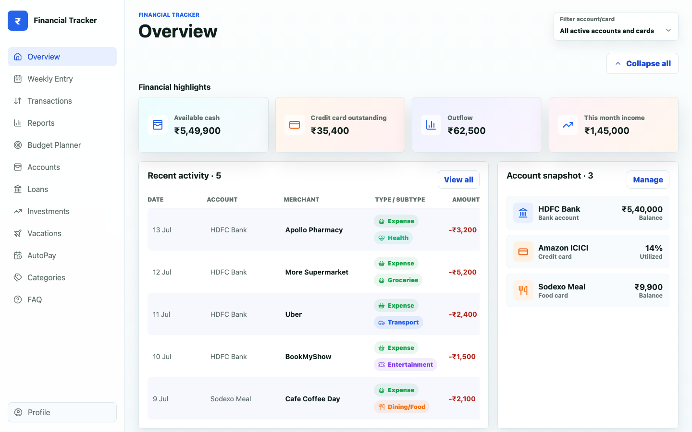

# Financial Tracker

A local-first personal finance tracker. It runs entirely on your own machine — the web app and its SQLite database both live on your computer, with no external hosting and no cloud account required.



> The screenshot above uses fake demo data for illustration.

## Features

- Weekly transaction entry across bank accounts, credit cards, and food cards
- Full transaction ledger with search and type/subtype filters
- Reports and category breakdowns
- Loan and account tracking
- Custom categories
- Import transactions from a spreadsheet
- Automatic local backups (every 30 minutes and on shutdown)

## How it works

- **Frontend:** React + Vite
- **Backend:** Node.js + Fastify
- **Database:** SQLite, stored locally at `data/finance.db`

Your data never leaves your device. Nothing is synced or uploaded anywhere — the database file is excluded from git via `.gitignore`, so only the application source code is version-controlled.

## Requirements

- [Node.js](https://nodejs.org/) 24 or later
- [pnpm](https://pnpm.io/installation) (`npm install -g pnpm`)

## Install and run (single machine)

```bash
# 1. Clone the repository
git clone https://github.com/rameshnaidu-github/financial-tracker.git
cd financial-tracker

# 2. Install dependencies
pnpm install

# 3. Build the app
pnpm build

# 4. Start it
pnpm start
```

The app will be available at **http://127.0.0.1:4000**.

On first run, the app creates its own SQLite database at `data/finance.db` — no setup required. Your data stays on this machine.

These steps work the same on **macOS, Windows, and Linux** — install Node.js and pnpm for your platform and run the commands above from a terminal (on Windows, use PowerShell or Command Prompt). The optional `scripts/start.sh` / `scripts/stop.sh` helpers are macOS/Linux-only; on Windows just use `pnpm start` and stop with `Ctrl+C`.

### Development mode

To run the frontend and backend with hot-reload while making changes:

```bash
pnpm dev
```

## Stopping the app

Press `Ctrl+C` in the terminal where it's running. This triggers a graceful shutdown backup before exiting.

## Backups

Automatic backups are written to the local `backups/` folder (also excluded from git):

- Every 30 minutes while the server is running
- On graceful shutdown (`Ctrl+C`)

## For a friend/second machine

Each install is fully independent. Cloning this repo on another computer and running the steps above creates a brand-new, empty database on that machine — it does not share or sync data with any other install.
